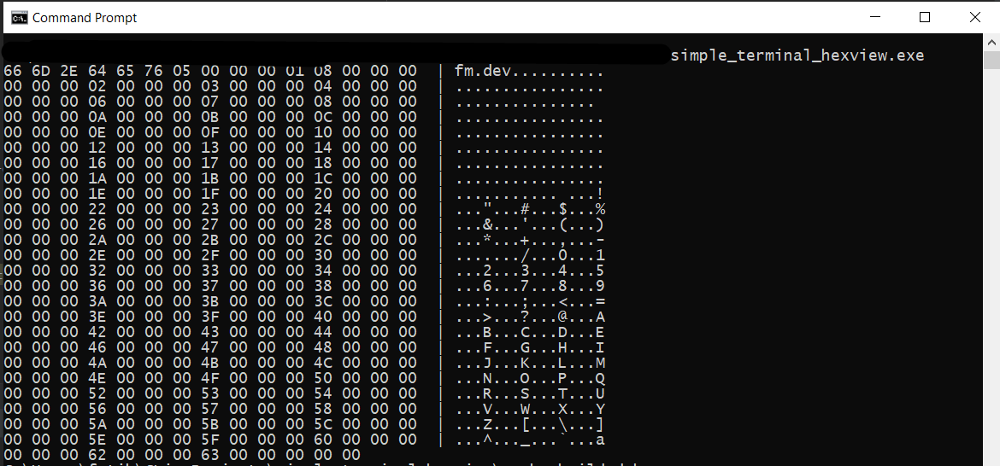

# Simple Terminal HexView

This project for beginner, basically reading file as binary and show to with `printf()` function.

This project writed C99.


Example use;

```bash
simple_terminal_hexview.exe -f filename.bin
```

Screenshoot




Thank you for visited this repo.


